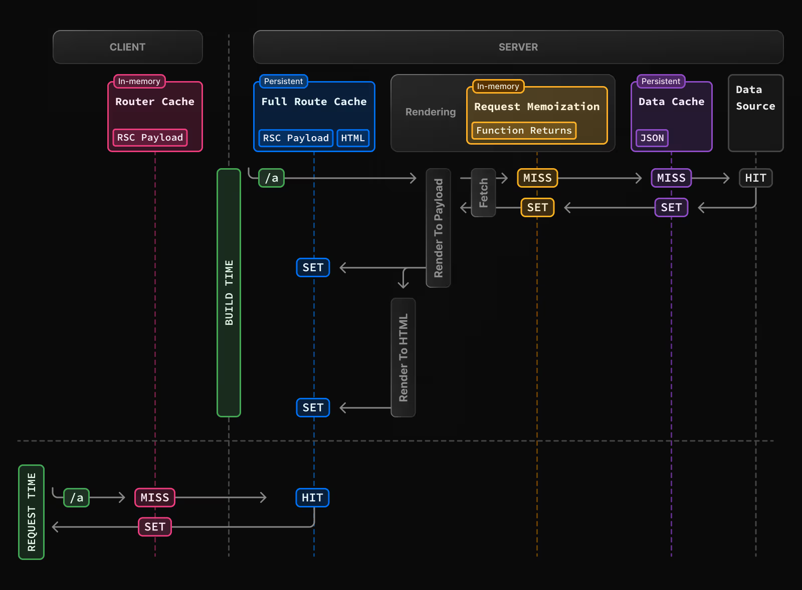

# Cache Component

## 1. Cache Component 是什麼？

Next.js 16 引入了全新的 React Server Component (RSC) 指令 —— `use cache`。讓開發者能標記特定的檔案、組件 (Component) 或函式 (Function) 是否需要在伺服器端進行快取 (Server Cache)，也就是 Cache Component。

Cache Component 的出現完善了 Partial Prerendering (PPR) 的架構，讓開發者在 Full Route Cache (複習請參考 [4. 舊版快取模式 Full Route Cache](#4-舊版快取模式-full-route-cache) ) 之外，擁有更靈活的選擇。

---

## 2. Cache Component 原理


開發者透過 `use cache` 指令，標記 Dynamic Rendering Route 下的 file、component 或 function ，使其成為快取區塊。

快取建立時機：

- Cache Component 在 Static Rendering Scope 內，在建置期 (Build Time) 做快取。
- Cache Component 在 Dynamic Rendering Scope 內，在執行階段 (Runtime) 首次請求時做快取。

---

## 3.  Cache Component 實作

> 實作範例：
[https://github.com/spencer778899/nextjs-cache-component/tree/feature/demo-use-cache](https://github.com/spencer778899/nextjs-cache-component/tree/feature/demo-use-cache)
> 

首先開啟 `next.config.ts` 中的設定

```tsx
// next.config.ts
export default {
  cacheComponents: true,
}

```

### 3.1 檔案層級（整頁快取）

```tsx
'use cache'

// 必須使用 async function
export default async function ComponentRenderTime() {
    const renderTime = new Date().toLocaleString();
    return (
        <div>
            <h3>頁面渲染時間</h3>
            <p>{renderTime}</p>
        </div>
    )
}

// 檔案中如果有其他 component 或 function，也會被 use cache 作用
```

### 3.2 Component 層級（部分快取）

```jsx
// 必須使用 async function
async function ComponentRenderTime() {
  'use cache'
  const renderTime = new Date().toLocaleString();
  
  return (
      <div
          <h3>頁面渲染時間</h3>
          <p>{renderTime}</p>
      </div>
  )
}
```

### 3.3 函式層級（配合 helper / data function）

```tsx
// 必須使用 async function
async function getTime() {
  "use cache";
  return new Date().toLocaleString();
}
```

---

## 4. 舊版快取模式 Full Route Cache

> 實作範例：
[https://github.com/spencer778899/nextjs-cache-component/tree/feature/demo-full-route-cache](https://github.com/spencer778899/nextjs-cache-component/tree/feature/demo-full-route-cache)
> 



Full Route Cache 是一種 Next.js 13 - 15 的「隱性判定」機制。Next.js 會自動識別並快取靜態渲染 (Static Rendering) 路由的 HTML + RSC payload，開發者無需手動介入。

這種「零配置」特性雖降低了開發門檻，卻也潛藏著效能陷阱。一旦在頁面中引入了 Dynamic API，不論是否是開發者有意為之，Next.js 都會自動將其轉為 Dynamic Rendering Route，導致 Full Route Cache 完全失效。

Dynamic APIs：

- `cookies`
- `headers`
- `connection`
- `draftMode`
- `searchParams` props
- `unstable_noStore`
- `fetch` with `{ cache: 'no-store' }`

---

## 5. full route cache vs use cache

|  | full route cache | cache component |
| --- | --- | --- |
| next.js version | v13 - v15  | v16 |
| 判定機制 | 隱性快取 | 顯性快取 |
| 誰決定是否快取 | 系統 | 開發者 |
| 快取粒度 | 整頁路由 | file / function / component |
| cache timing | build time | build time or first request  |
| 可讀性 | 較差 (會被 Dynamic API 影響，丟失整頁快取) | 較佳 (正向表述) |
| 學習成本 | 低 | 中等 |

---

## 6. 如何在既有專案導入 Cache component


個人建議可以先從 build console 觀察：

- static route：仍然保留 full route cache 的行為，不做重構
- dynamic route：有優化空間，對於可快取的 component，可以依據渲染成本由高到低，逐一改為 Cache component
    
    
    | Scope（作用範圍） | 是否適合  | 常見例子 |
    | --- | --- | --- |
    | **純資料函式（Data / Repository layer）** | ✅  | `getProduct(id)`
    `listPosts({ locale })`
    `getExchangeRate(currency)` |
    | **資料轉換 / 組合（Transform / Composition）** | ✅  | CMS + DB 合併、排序、分群、格式化 |
    | 使用者資料頁面 | ❌ | `/dashboard`、`/profile` |
    | **User-specific（使用者特定）** | ❌ | `getMe()`、`getCart()` |

---

## 7. Cache Component 快取生命週期設定

### 7.1 Stale

控制 Client-side Router Cache 的有效時長。在 `stale` 時間內，當使用者命中快取時，會直接從本地記憶體取得資料，不會向伺服器發送請求。

補充：你可以透過 Devtools > Network > Response headers > X-Nextjs-Stale-Time  觀測你設定的 stale 時長。


### 7.2 Revalidate

當兩次請求間隔超過 `revalidate` 設定的時間，此時發起的請求會先回傳舊快取資料，並且更新 server side cache。

### 7.3 Expire

代表 sever side cache 的絕對期限。當快取資料超過 `expire` 設定的時間未更新，此時發起的請求會先驅動 server side cache 更新後，才回傳最新的資料。

### 7.4 比較

|  | **`stale`** | **`revalidate`**  | **`expire`** |
| --- | --- | --- | --- |
| 控制對象 | Client-side  | Server-side  | Server-side  |
| 超時後的動作 | 發送 Request | 先回傳舊資料，再更新資料 | 先更新資料，再回傳新資料 |
| 使用者感知 | 瞬間載入 | 快 | 慢 |

### 7.5 全域設定

Next.js 預設的 `stale`, `revalidate`, `expire` 時間如下，並且有提供多種屬性，讓開發者可以視情況套用在不同 Cache Component 上。


開發者也可以在 `next.config.ts` 中覆蓋或是客製化 Profile。

```jsx
// next.config.ts
import type { NextConfig } from 'next'
 
const nextConfig: NextConfig = {
  cacheComponents: true,
  cacheLife: {
	  // 覆蓋 next.js 的設定
	  default: { 
		  stale: 60 * 10,
		  revalidate: 60 * 30,
		  expire: 60 * 60 * 24 * 365 * 2
		},
		// 客製化設定
    biweekly: {
      stale: 60 * 60 * 24 * 14, 
      revalidate: 60 * 60 * 24, 
      expire: 60 * 60 * 24 * 14,
    },
  },
}
 
export default nextConfig
```

### 7.6 客製化設定 Cache Component 生命週期

你可以在 Cache Component 中的 `use cache` 後，使用 `cacheLife()` 來設定該 component 的 `stale`, `revalidate` 和 `expire` 屬性。

```jsx
import { cacheLife } from 'next/cache'
 
async function getData() {
  'use cache'
  cacheLife('hours') // Use built-in 'hours' profile
  return fetch('/api/data')
}
```